# 🚲 Bike Store Lakehouse Project

  

This project implements a production-grade **Lakehouse Architecture** using **Databricks**, **PySpark**, and **Delta Lake**. It ingests raw operational data from the Bike Store dataset, cleans and standardizes it, and transforms it into a star-schema for analytics, following the **Medallion Architecture** (Bronze → Silver → Gold).

The repository serves as both a **technical reference** and a **portfolio-ready demonstration** of production-grade data engineering patterns.

---

## 📊 Dataset

The project uses the publicly available **Bike Store Sample Dataset**, downloadable from Kaggle:

**Dataset Link:** [Bike Store Sample Database](https://www.kaggle.com/datasets/dillonmyrick/bike-store-sample-database)

CSV files used in this project include:

* brands
* categories
* customers
* order_items
* orders
* products
* staffs
* stocks
* stores

All raw files should be placed under:

```
Pro/Raw Data/<entity>/<entity>.csv
```

---

## 🏗️ Architecture Overview

This project follows the **Medallion Architecture** with three layers: **Bronze**, **Silver**, and **Gold**.


### **Bronze Layer — Raw Ingestion**

* Reads CSV files directly from the workspace
* Uses structured streaming (`availableNow`) to simulate streaming ingestion
* Preserves the raw schema
* Detects entities automatically based on folder names
* Writes each table as a Delta table in the `bronze` schema
* Adds ingestion timestamp metadata

### **Silver Layer — Cleaning & Standardization**

* Centralized cleaning using `GeneralTransformer.py`
* Standardizes column names to lowercase
* Deduplicates based on entity business keys
* Extracts additional features (email domain, full names, etc.)
* Enforces consistent schemas
* Writes clean Delta tables into the `silver` schema

**Data Quality Rules:**

* Deduplication per business keys
* Full name creation for `staffs` and `customers`
* Email domain extraction
* Default value handling for products
* Uniform timestamp column: `process_timestamp`

### **Gold Layer — Analytics & Dimensional Modeling**

* Builds star-schema tables:

  * Dimensions: `dim_products`, `dim_customers`, `dim_stores`, `dim_staffs`
  * Facts: `fact_sales`, `fact_inventory`
* Computes KPIs:

  * Daily revenue
  * Top products by sales
  * Customer Lifetime Value (LTV)
* Outputs curated Delta tables in the `gold` schema

**Performance Techniques:**

* Selective partitioning for large tables
* Clear dimension/fact separation
* Precomputed aggregations for dashboards

**Delta Lake Advantages:**

* ACID transactions
* Optimized storage layout
* Streaming-compatible ingestion
* Metadata-based schema management

---

## 💡 Data Pipeline Diagram

```mermaid
graph LR
    %% Styles
    classDef raw fill:#e1f5fe,stroke:#01579b,stroke-width:2px;
    classDef silver fill:#fff9c4,stroke:#fbc02d,stroke-width:2px;
    classDef gold fill:#e8f5e9,stroke:#2e7d32,stroke-width:2px;
    classDef kpi fill:#f3e5f5,stroke:#7b1fa2,stroke-width:2px,stroke-dasharray: 5 5;

    subgraph Bronze_Layer [🥉 Bronze Layer: Raw Ingestion]
        direction TB
        B1(orders)
        B2(order_items)
        B3(customers)
        B4(products)
        B5(stores/stocks)
        B6(brands/categories)
        B1 & B2 & B3 & B4 & B5 & B6:::raw
    end

    subgraph Silver_Layer [🥈 Silver Layer: Cleaning & Enriched]
        direction TB
        S1(Clean Orders)
        S2(Clean Items)
        S3(Clean Customers)
        S4(Clean Products)
        S5(Clean Stores/Stocks)
        S1 & S2 & S3 & S4 & S5:::silver
    end

    subgraph Gold_Layer [🥇 Gold Layer: Dimensional Modeling]
        direction TB
        F1[(Fact Sales)]
        F2[(Fact Inventory)]
        D1[Dim Products]
        D2[Dim Customers]
        D3[Dim Stores]
        D4[Dim Staff]
        F1 & F2 & D1 & D2 & D3 & D4:::gold
    end

    subgraph Insights [📈 KPI & Analytics]
        K1(Daily Revenue)
        K2(Top Products)
        K3(Customer LTV)
        K1 & K2 & K3:::kpi
    end

    %% Flow Connections
    B1 -->|Dedupe & Cast| S1
    B2 -->|Standardize| S2
    B3 -->|Split Email/Name| S3
    B4 & B6 -->|Fill Nulls| S4
    B5 -->|Dedupe| S5

    %% Gold Modeling
    S1 & S2 & S4 -->|Join & Calculate Net Amount| F1
    S5 -->|Snapshot| F2
    S4 -->|Denormalize Brand+Cat| D1
    S3 -->|Select PII| D2
    S5 -->|Select Location| D3

    %% KPI Generation
    F1 -->|Agg Sum| K1
    F1 -->|Agg GroupBy| K2
    F1 & D2 -->|RFM Calculation| K3
```



---

## 📂 Repository Structure

```
Pro/
│-- Raw Data/               # CSV source data organized by entity
│-- Bronze Layer.py         # Raw ingestion pipeline
│-- Silver Tier.py          # Data cleaning & standardization
│-- Gold Layer.py           # Analytics layer + KPIs
│-- GeneralTransformer.py   # Shared cleaning logic
│-- Dataset Link.txt        # Direct dataset reference
│-- Readme.md               # Project documentation
```

---

## ✔️ Current Feature Completion

### **Bronze Layer**

* [x] Automated ingestion of all CSV entities
* [x] Schema inference
* [x] Streaming load with Delta
* [x] Partitioning rules for large tables

### **Silver Layer**

* [x] Standardization
* [x] Deduplication
* [x] Feature extraction
* [x] Centralized transformation logic

### **Gold Layer**

* [x] Dimension models
* [x] Fact models
* [x] Daily revenue KPI
* [x] Top products KPI
* [x] Customer LTV model

---

## 🚀 Running the Project

1. Upload the dataset into the folder structure under `Pro/Raw Data/`
2. Run **Bronze Layer.py** to ingest raw files into Delta tables
3. Run **Silver Tier.py** to clean and standardize the data
4. Run **Gold Layer.py** to build dimensional models and KPIs

All tables are stored under the catalog:

```
bike_store_project
├── bronze
├── silver
└── gold
```

---

## 📘 References

* Databricks Lakehouse Architecture
* Delta Lake Documentation
* Kaggle Bike Store Dataset
